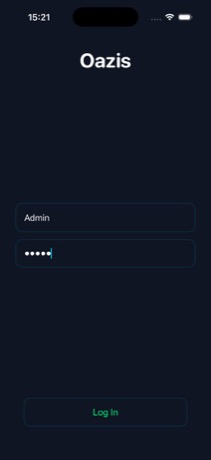
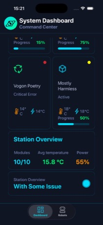
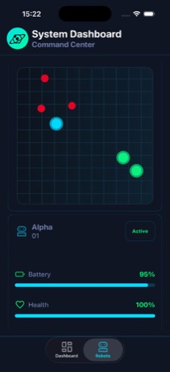
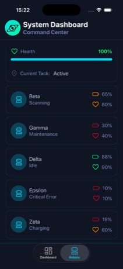
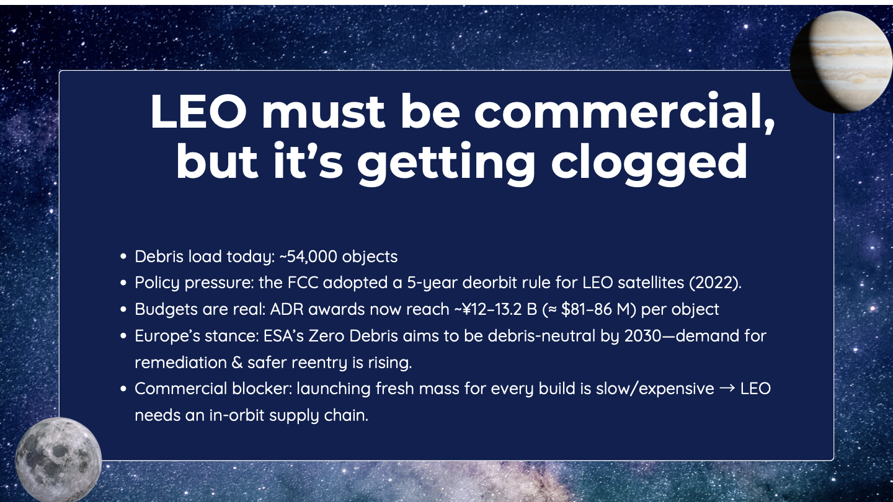

# Oazis

Oazis is a personal iOS pet project focused on building a futuristic space-station monitoring interface in SwiftUI.  
The app explores custom UI components, animated visuals, and dashboard-style data presentation for robots and station modules.

## What this app includes

- Login screen with a custom neon-style dark theme
- Dashboard with module cards, status summaries, and progress bars
- Robots tab with robot list, detail cards, and health/battery indicators
- Reusable SwiftUI components and style extensions

## Tech stack

- Swift
- SwiftUI
- Xcode project (`Oazis.xcodeproj`)
- Local mock/demo data (no backend required)

## Run locally

1. Clone the repository:

```bash
git clone https://github.com/werter08/Oazis.git
```

2. Open `Oazis.xcodeproj` in Xcode.
3. Choose an iOS simulator (or device).
4. Run with `Cmd + R`.

## Demo login

The current app uses demo credentials in the login screen:

- Username: `1admin`
- Password: `1admin`

If you change auth logic later, update this section.

## Screenshots

### App screens






### Concept preview (from `presentation.pdf`)



## Project status

This is an active learning/pet project, so UI, architecture, and feature set can change as I iterate.